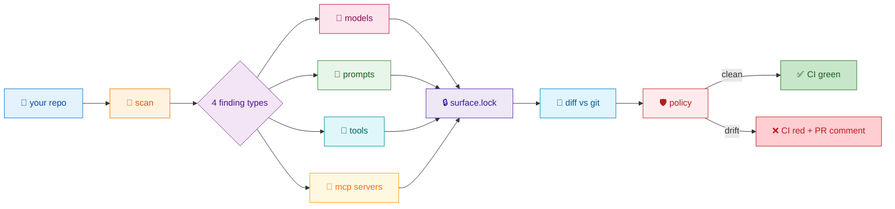

<div align="center">

# 🔒 surfacelock

### A lockfile for the AI surface of your codebase

**`package-lock.json` pins your dependencies. `surface.lock` pins your models, prompts, tool schemas and MCP servers — and fails CI when they change without review.**

<br>

[](https://pypi.org/project/surfacelock/)
[](https://www.python.org/)
[](LICENSE)
[](.github/workflows/ci.yml)
[](https://mypy-lang.org/)
[](https://docs.astral.sh/ruff/)

<br>

```text
  ┌───────────────────────────────────────────────────────────────────┐
  │  $ surfacelock check                                              │
  │                                                                   │
  │  🔒 surfacelock check                                             │
  │                                                                   │
  │    AI surface drift:                                              │
  │    ✏️  model   claude-3-5-sonnet-latest  claude-3-5-sonnet-…      │
  │    ✏️  prompt  agent.planner.system      412 → 453 tokens (+41)    │
  │                                                                   │
  │    ✖ MODEL_RETIRING  src/agent.py:36                              │
  │        `claude-3-5-sonnet-latest` retires on 2026-10-20 (21 days) │
  │        https://…/findings/MODEL_RETIRING.md                       │
  │                                                                   │
  │    1 errors · 0 warnings · 0 suppressed                           │
  │    ✖ check failed                                                 │
  └───────────────────────────────────────────────────────────────────┘
```

</div>

---

## 🎯 The problem

Your AI layer is the **only** part of the system that changes behaviour without changing code.

| 💥 Failure mode | What happens | Who notices |
|---|---|---|
| **Floating aliases** | `gpt-4o`, `claude-…-latest` silently resolve to a new snapshot | Nobody — until quality drops |
| **Prompt drift** | A prompt is "tidied" in an unrelated PR | Nobody — until a regression |
| **Schema creep** | Tool/function schemas and MCP configs change under agents | Nobody — until a rug-pull |
| **Silent retirement** | Providers retire models on 6–12 month cycles | You — from a 404 in production |

Every one of these is a recurring incident class with **no gate in the delivery pipeline**.

> ### 💡 The insight
> We already solved this for dependencies: lockfiles + CI diffs.
> The AI surface is just another dependency surface. So we pin it the same way.

---

## ✨ What it does

<div align="center">



</div>

<table>
<tr>
<td width="25%" align="center">🧠<br><b>Models</b><br><sub>19 provider families<br>floating alias detection<br>retirement dates</sub></td>
<td width="25%" align="center">📝<br><b>Prompts</b><br><sub>annotated · file · inline<br>sha256 + token counts<br>id collision detection</sub></td>
<td width="25%" align="center">🧰<br><b>Tools</b><br><sub>OpenAI · Anthropic · MCP<br>Pydantic · LangChain<br>Vercel AI SDK</sub></td>
<td width="25%" align="center">🔌<br><b>MCP servers</b><br><sub>9 config formats<br>transport inference<br><b>secrets never recorded</b></sub></td>
</tr>
</table>

---

## 🚀 Quickstart

```bash
pipx install surfacelock
```

```bash
# 1. See what your AI surface looks like — writes nothing
$ surfacelock scan

# 2. Freeze it
$ surfacelock init
   🔒 surfacelock init
      wrote /repo/surface.lock
      3 models · 4 prompts · 2 tools · 2 mcp servers

# 3. Gate every PR on it
$ surfacelock check
   ✓ lockfile is up to date
   ✓ check passed
```

Then drop the GitHub Action in and you're done:

```yaml
# .github/workflows/surfacelock.yml
name: surfacelock
on: [pull_request]
permissions:
  contents: read
  pull-requests: write
jobs:
  ai-surface:
    runs-on: ubuntu-latest
    steps:
      - uses: actions/checkout@v4
      - uses: iggym/surfacelock@v0.1.0
        with:
          comment: "true"
```

---

## 📦 What lands in `surface.lock`

<div align="center">
<sub>TOML · deterministic order · no timestamps in the body · reviewable like any lockfile</sub>
</div>

```toml
# surface.lock — generated by surfacelock. Review changes like package-lock.json.
[meta]
surfacelock_version = "0.1.0"
registry_updated = "2026-09-30"
scan_config_hash = "9f2c1a4b7e0d3c58"

[meta.counts]
models = 3
prompts = 4
tools = 2
mcp_servers = 2

[[model]]
name = "claude-3-5-sonnet-latest"     # 🧠 as written in code
provider = "anthropic"
kind = "chat"
resolved = "claude-3-5-sonnet-20241022"  # 🔒 pinned snapshot
floating = true
known = true
locations = ["src/agent.py:36"]
retirement = "2026-10-20"
price_in_per_1m = 3.0
price_out_per_1m = 15.0

[[prompt]]
id = "agent.planner.system"
path = "src/agent.py"
line = 6
sha256 = "b1946ac92492d2347c6235b4d2611184…"
chars = 512
approx_tokens = 128
source = "annotated"                  # 📝 annotated | file | inline

[[tool]]
name = "issue_refund"
path = "src/agent.py"
line = 25
sha256 = "9f9bf9d1c1f0c2e5a7b3d4e6f8a0c2d4…"
source = "python-dict"
description = "Issue a refund to the customer"
param_keys = ["amount", "order_id"]

[[mcp_server]]
name = "crm"
path = ".cursor/mcp.json"
transport = "http"
url = "https://crm.internal.example/mcp"
env_keys = ["CRM_TOKEN"]              # 🔐 names only — never values
sha256 = "4d5e6f7a8b9c0d1e2f3a4b5c6d7e8f9a…"
```

---

## 🎨 Command reference

| Command | What it does | Exit |
|:---|:---|:---:|
| `surfacelock` | `check` if a lockfile exists, else `scan` + hint | — |
| `surfacelock scan [path] [--json]` | Show findings, write nothing | `0` |
| `surfacelock init [path] [--force]` | Write `surface.lock`, print policy findings | `0`/`1` |
| `surfacelock check [--format text\|json\|markdown]` | Rescan, diff, run policy | `0`·`1`·`2` |
| `surfacelock update [--resolve all]` | Rewrite the lock, print deltas | `0` |
| `surfacelock explain [--base FILE]` | Markdown PR summary | `0` |
| `surfacelock registry [name] [--check]` | Calendar · lookup · validate | `0`/`1` |
| `surfacelock pin <alias> [--all] [--yes]` | **Rewrite source** to the pinned snapshot | `0` |
| `surfacelock doctor` | Environment diagnostics | `0` |

<div align="center">

### 🔍 `surfacelock registry` — the retirement calendar

```text
📅 surfacelock retirement calendar
   registry updated 2026-09-30 · 176 entries

  model                               provider   retirement   in
  ----------------------------------  ---------  -----------  ------
  gpt-4-0314                          openai     2024-06-13   retired
  claude-2.0                          anthropic  2025-07-21   retired
  grok-beta                           xai        2025-09-15   retired
  o1-preview                          openai     2025-10-27   27d
  claude-3-5-sonnet-20241022          anthropic  2026-10-20   385d
```

</div>

---

## 🛡️ Policy — 13 stable finding codes

Every finding has a stable code, a fixed severity, and a documentation page explaining **why** and **how to fix**.

| Code | Severity | Catches |
|:---|:---:|:---|
| `UNPINNED_MODEL` | 🔴 error | floating alias in code |
| `UNKNOWN_MODEL` | 🟡 warn | model not in the registry |
| `MODEL_DEPRECATED` | 🟡 warn | retirement inside the warn window (90d) |
| `MODEL_RETIRING` | 🔴 error | retirement inside the fail window (30d) |
| `MODEL_RETIRED` | 🔴 error | already retired |
| `MODEL_DENIED` | 🔴 error | on the deny list |
| `MODEL_NOT_ALLOWED` | 🔴 error | not on the allow list |
| `PROVIDER_NOT_ALLOWED` | 🔴 error | provider not on the allow list |
| `MCP_INSECURE` | 🔴 error | plaintext `http://` MCP endpoint |
| `MCP_UNPINNED` | 🟡 warn | unversioned `npx`/`uvx`/`bunx`/`pipx` |
| `PROMPT_TOO_LARGE` | 🔴 error | prompt exceeds a token budget |
| `PROMPT_NO_OWNER` | 🟡 warn | no CODEOWNERS match |
| `PROMPT_ID_COLLISION` | 🔴 error | two prompts claim one id |

<div align="center">

**Inline suppression — with a reason, on the offending line:**

```python
model = "gpt-4o"  # surfacelock: allow UNPINNED_MODEL reason="vendor SDK requires the alias"
```

<sub>Suppressions are listed in `check --verbose` and counted in every PR summary.</sub>

</div>

---

## ✍️ Annotations — explicit always wins

```python
# surfacelock: prompt id=agent.planner.system
PLANNER_SYSTEM = """You are a careful planner..."""

# surfacelock: model
DEPLOYMENT = "my-custom-ft-deployment"

model = "gpt-4o"  # surfacelock: ignore
```

| Annotation | Effect |
|:---|:---|
| `surfacelock: model` | Treat the next/same-line string as a model |
| `surfacelock: prompt [id=…]` | Treat it as a prompt with a stable id |
| `surfacelock: ignore` | Report nothing from this line |
| `surfacelock: allow CODE reason="…"` | Suppress one policy finding |

---

## 🔬 Detection rules at a glance

<table>
<tr><th align="left">Finding</th><th align="left">Sources</th></tr>
<tr>
<td><b>🧠 Models</b></td>
<td>String literals in <b>Python · TS/JS/TSX · Go · Rust · Java/Kotlin · C# · Ruby · YAML · JSON · TOML · .env · .ini</b>.<br>
Detection = <i>provider regex family</i> <b>∧</b> (<i>known to registry</i> ∨ <i>model-context keyword</i> ∨ <i>annotated</i>).<br>
Azure: <code>deployment_name=</code> / <code>azure_deployment=</code> → <code>context=deployment</code>.</td>
</tr>
<tr>
<td><b>📝 Prompts</b></td>
<td><b>(a)</b> annotated · <b>(b)</b> files under <code>prompt/</code>, <code>prompts/</code>, <code>system_prompts/</code>, <code>instructions/</code> or with prompt extensions · <b>(c)</b> inline: prompt-ish names ≥ 160 chars, or any ≥ 400-char string with a newline.</td>
</tr>
<tr>
<td><b>🧰 Tools</b></td>
<td>OpenAI <code>{"type":"function"}</code> · Anthropic/MCP <code>{name, input_schema}</code> · Python <code>@tool</code>, <code>@mcp.tool()</code>, <code>@function_tool</code>, <code>@agent.tool</code> · Pydantic <code>tools=[…]</code> · LangChain <code>StructuredTool.from_function</code> · TS <code>tool({…})</code>, <code>server.tool("name", …)</code></td>
</tr>
<tr>
<td><b>🔌 MCP servers</b></td>
<td><code>.cursor/mcp.json</code> · <code>.vscode/mcp.json</code> · <code>.claude/mcp.json</code> · <code>.mcp.json</code> · <code>mcp.json</code> · <code>claude_desktop_config.json</code> · <code>.gemini/settings.json</code> · <code>.codex/config.toml</code> · <code>.continue/config.yaml</code> · any <code>*mcp*.{json,yaml,toml}</code></td>
</tr>
</table>

> 🎯 **Conservative by design.** A bare `"1.5.0"` never matches. A model name in a comment or a markdown doc never matches. We prefer a miss over a false positive — annotations close the gap.

---

## 📊 Measured performance

| Metric | Target | Notes |
|:---|:---|:---|
| 10,000 files / 200 MB | **< 5 s** | single pass, 8-way thread pool |
| Files > 2 MB | skipped | plus binary detection |
| Determinism | byte-identical | file order on disk is irrelevant |

---

## 🧩 Four ways to use it

<table>
<tr><th align="left">Surface</th><th align="left">How</th></tr>
<tr><td>🖥️ <b>CLI</b></td><td><code>pipx install surfacelock</code></td></tr>
<tr><td>⚙️ <b>GitHub Action</b></td><td><code>uses: iggym/surfacelock@v0.1.0</code> — sticky PR comment + job summary</td></tr>
<tr><td>🪝 <b>pre-commit</b></td><td><code>surfacelock-check</code> · <code>surfacelock-update</code></td></tr>
<tr><td>🐍 <b>Python API</b></td><td><code>from surfacelock import scan, build_lock, check</code></td></tr>
</table>

```python
from surfacelock import scan, build_lock, check, Registry

# Inventory the AI surface
result = scan(".")
print(len(result.models), "models,", len(result.prompts), "prompts")

# Build a lockfile programmatically
registry = Registry.load(".")
lock = build_lock(".", registry=registry)

# Gate CI
outcome = check(".", today="2026-09-30")
raise SystemExit(outcome.exit_code)
```

---

## 🗂️ Repository layout

```text
src/surfacelock/
├── __init__.py          🐍 public API + __version__
├── cli.py               ⌨️  argparse; thin; delegates
├── scanners/
│   ├── __init__.py      🔎 orchestrator + gitignore-aware walker
│   ├── models.py        🧠 regex families + context filter
│   ├── prompts.py       📝 annotated / file / inline
│   ├── tools.py         🧰 json/yaml/python/ts extractors
│   ├── mcp.py           🔌 config parsers
│   ├── annotations.py   ✍️  shared annotation grammar
│   └── textutil.py      🔤 string-literal extraction
├── registry/            📚 Registry, ModelInfo, 176 entries + JSON Schema
├── lockfile.py          🔒 build / read / write / diff
├── policy.py            🛡️  Policy, Finding, check_policy
├── explain.py           🎨 Markdown PR summary
├── pin.py               📌 source rewriting
├── tokens.py            🔢 deterministic token estimator
└── output.py            🌈 colour, tables, JSON envelopes
```

**Dependencies:** `pyyaml` · `tomli-w` · `pathspec` — that's it. Optional: `[tokens] tiktoken`.

---

## 🚫 Non-goals (v0.1)

Not a prompt registry/CMS · not a prompt-versioning SDK · not an eval tool · not runtime enforcement.
**No network calls. No provider API introspection. No telemetry.**

---

<div align="center">

## 🧭 Principles

**Deterministic** · **Conservative** · **Zero-config first run** · **Human-readable lockfile** · **Annotations always win** · **Fast**

<br>

### License

[Apache-2.0](LICENSE) © surfacelock contributors

<br>

<sub>⭐ If this saved you an incident, star the repo — it's the cheapest way to say thanks.</sub>

</div>
